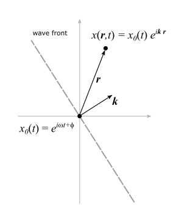
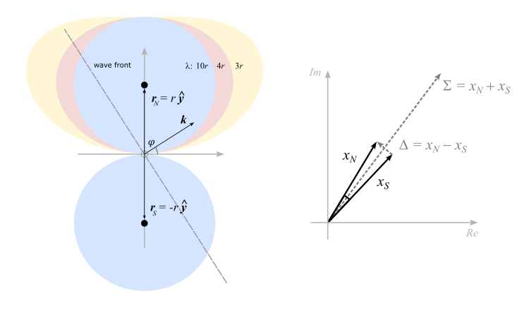

= *Title*
Author Name
LPR1, {docdate}
:stem: latexmath
:eqnums:
:sectnums:
:xrefstyle: short
:figure-caption: Figure
:stylesheet: asciidoctor-default.css
:stylesdir: styles

[[sec:chapter1]]
== Chapter 1

In the following text a cartesian coordinate system is defined with latexmath:[x] pointing east, latexmath:[y] pointing north and latexmath:[z] pointing straght up. A 3-dimensional vector latexmath:[\boldsymbol{v}] is denoted with a bold font and it's absolute value latexmath:[v] with a normal font.  

[[sec:section1]]
=== Section

.A plane wave
[#img-figure1]

Consider a plane wave with angular wave number latexmath:[\boldsymbol{k}] which points in the direction of the vector normal to the wave plane and has the magnitude latexmath:[k=2\pi/\lambda]. 

In a point selected as the origin latexmath:[\boldsymbol{r}=\boldsymbol{0}] it will generate a signal latexmath:[x_0(t) = Ae^{i\omega t+\phi}], where latexmath:[$\omega=c/k$]. The phase latexmath:[\phi] will depend on the location of this origin and the choice of latexmath:[t=0],  and the amplitude latexmath:[A] will depend on the signal strength and antenna properties and orientation, but lets normalize it to one here.

Assuming a simple carrier wave with stationary amplitude and angular frequency latexmath:[\omega] (this is an extreme case of the so called _narowband approximation_), the signal latexmath:[x(t)] at an arbitrary point latexmath:[\boldsymbol{r}] will be given by just a spatial phase shift of the amount latexmath:[\boldsymbol{k}\cdot\boldsymbol{r}]. Hence

[latexmath#eq-1]
++++
\begin{equation}
x(\boldsymbol{r},t) = x_0(t)e^{i{\boldsymbol{k}}\cdot{\boldsymbol{r}}}
\end{equation}
++++

[[sec:section2]]
=== Section

Now consider two antennas located at latexmath:[\boldsymbol{r}_N] and latexmath:[\boldsymbol{r}_S], with equal distance latexmath:[r] and and opposite direction from the origin according to <>. If we use that latexmath:[\boldsymbol{r}_N = -\boldsymbol{r}_S] and take the difference and the sum of the signal in the two antennas, we get using Eulers formula 

[latexmath#eq-2]
++++
\begin{equation}
\begin{aligned}
x_{N-S}(t) & = x(\boldsymbol{r_N},t) - x(\boldsymbol{r_S},t) = x_0(t)(e^{i{\boldsymbol{k}}\cdot{\boldsymbol{r}_N}} -e^{-i{\boldsymbol{k}}\cdot{\boldsymbol{r}_N}}) = \,x_0(t)\,2i\sin({\boldsymbol{k}}\cdot{\boldsymbol{r}_N}) \\
x_{N+S}(t) & = x(\boldsymbol{r_N},t) + x(\boldsymbol{r_S},t) = x_0(t)(e^{i{\boldsymbol{k}}\cdot{\boldsymbol{r}_N}} + e^{-i{\boldsymbol{k}}\cdot{\boldsymbol{r}_N}}) = \,x_0(t)\,2\cos({\boldsymbol{k}}\cdot{\boldsymbol{r}_N})
\end{aligned}
\end{equation}
++++

Assuming the wave comes in from an azimuth direction latexmath:[\varphi] and with zero elevation, we have , using latexmath:[k=2\pi/\lambda], that latexmath:[\boldsymbol{k}\cdot{\boldsymbol{r}_N} = kr\cos(\pi/2-\varphi) = 2\pi\frac{r}{\lambda}\sin(\varphi)]. And after rearranging we get

[latexmath#eq-3]
++++
\begin{equation}
\begin{aligned}
x_{N-S}(t) & = 2\sin\left(2\pi\frac{r}{\lambda}\sin(\varphi)\right)\,\, ix_0(t) := \Delta(t)\\
x_{N+S}(t) & = 2\cos\left(2\pi\frac{r}{\lambda}\sin(\varphi)\right)\,\, x_0(t) := \Sigma(t)
\end{aligned}
\end{equation}
++++

latexmath:[x_0(t)] is the signal that an antenna at the origin would pick up. latexmath:[ix_0(t)] is  that signal phase-shifted by 90latexmath:[^\circ]. The factor in front gives the signal amplitude dependence on the azimuth angle latexmath:[\varphi]. The factor of 2 in front of the sine reflects the fact that the signal from the two antennas are added in the directions where the interference is constructive.

As latexmath:[\lambda] becomes much bigger than latexmath:[r], the approximations latexmath:[sin(x) \to x] and latexmath:[cos(x) \to 1] for small latexmath:[x] gives the following simple latexmath:[\varphi]-dependent gain for the amplitude

[latexmath#eq-4]
++++
\begin{equation}
\begin{aligned}
|\Delta| & \underset{\lambda \gg r}{=} \frac{4\pi r}{\lambda}|\sin(\varphi)| \\
|\Sigma| & \underset{\lambda \gg r}{=} 2
\end{aligned}
\end{equation}
++++

These are equations for perfect circles in polar coordinates. The first one is a circle with radius latexmath:[\frac{2\pi r}{\lambda}] and the center located at latexmath:[(\rho,\varphi)=(\frac{2\pi r}{\lambda},\pi)] and the second one is a circle centered at the origin with radius latexmath:[2]. So when the wavelength becomes large, and the phase-difference between the antennas therefore becomes negligible, the subtracted signal vanishes and the added signal becomes doubled, just as expected.

.(*left*) A pair of antennas located at distance latexmath:[2r]. The hatched line illustrates a plane wave front with angular wave vector latexmath:[\boldsymbol{k}] for some wavelength latexmath:[\lambda] (latexmath:[k=2\pi/\lambda]). The colored areas shows the gain patterns for three different wavelengths, latexmath:[2r], latexmath:[4r] and latexmath:[3r]. (*right*) A polar diagram showing the sum- and difference-signals. The phase difference between the latexmath:[x_N] and latexmath:[x_S] signals will depend on latexmath:[\lambda] and the azimuth latexmath:[\varphi]. The magnitude of the sum-signal is approximately constant for small phase differences.  
[#img-figure2]

[[sec:section3]]
=== Section

If the field consists of multiple plane waves arriving from different directions due to reflections, scattering or multiple transmissions the situation becomes a bit different. Each wave can of course be described like above and superimposed. The result of this is however that the latexmath:[\Sigma] - latexmath:[\Delta] phase difference in general is no longer 90latexmath:[^\circ]. 

This can be understood by looking at <<eq-4,>> ... 

[[sec:chapter2]]
== Chapter 2
...
